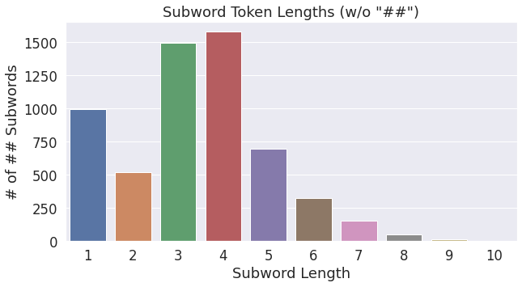

## Load the Model

Inspired from [BERT Word Embeddings Tutorial](http://mccormickml.com/2019/05/14/BERT-word-embeddings-tutorial/) by Chris McCormick.


Install the huggingface implementation.


```python
!pip install pytorch-pretrained-bert
```

    Collecting pytorch-pretrained-bert
    [?25l  Downloading https://files.pythonhosted.org/packages/d7/e0/c08d5553b89973d9a240605b9c12404bcf8227590de62bae27acbcfe076b/pytorch_pretrained_bert-0.6.2-py3-none-any.whl (123kB)
         |████████████████████████████████| 133kB 2.8MB/s 
    [?25hRequirement already satisfied: torch>=0.4.1 in /usr/local/lib/python3.6/dist-packages (from pytorch-pretrained-bert) (1.6.0+cu101)
    Requirement already satisfied: numpy in /usr/local/lib/python3.6/dist-packages (from pytorch-pretrained-bert) (1.18.5)
    Requirement already satisfied: tqdm in /usr/local/lib/python3.6/dist-packages (from pytorch-pretrained-bert) (4.41.1)
    Requirement already satisfied: boto3 in /usr/local/lib/python3.6/dist-packages (from pytorch-pretrained-bert) (1.14.47)
    Requirement already satisfied: regex in /usr/local/lib/python3.6/dist-packages (from pytorch-pretrained-bert) (2019.12.20)
    Requirement already satisfied: requests in /usr/local/lib/python3.6/dist-packages (from pytorch-pretrained-bert) (2.23.0)
    Requirement already satisfied: future in /usr/local/lib/python3.6/dist-packages (from torch>=0.4.1->pytorch-pretrained-bert) (0.16.0)
    Requirement already satisfied: s3transfer<0.4.0,>=0.3.0 in /usr/local/lib/python3.6/dist-packages (from boto3->pytorch-pretrained-bert) (0.3.3)
    Requirement already satisfied: jmespath<1.0.0,>=0.7.1 in /usr/local/lib/python3.6/dist-packages (from boto3->pytorch-pretrained-bert) (0.10.0)
    Requirement already satisfied: botocore<1.18.0,>=1.17.47 in /usr/local/lib/python3.6/dist-packages (from boto3->pytorch-pretrained-bert) (1.17.47)
    Requirement already satisfied: idna<3,>=2.5 in /usr/local/lib/python3.6/dist-packages (from requests->pytorch-pretrained-bert) (2.10)
    Requirement already satisfied: certifi>=2017.4.17 in /usr/local/lib/python3.6/dist-packages (from requests->pytorch-pretrained-bert) (2020.6.20)
    Requirement already satisfied: chardet<4,>=3.0.2 in /usr/local/lib/python3.6/dist-packages (from requests->pytorch-pretrained-bert) (3.0.4)
    Requirement already satisfied: urllib3!=1.25.0,!=1.25.1,<1.26,>=1.21.1 in /usr/local/lib/python3.6/dist-packages (from requests->pytorch-pretrained-bert) (1.24.3)
    Requirement already satisfied: python-dateutil<3.0.0,>=2.1 in /usr/local/lib/python3.6/dist-packages (from botocore<1.18.0,>=1.17.47->boto3->pytorch-pretrained-bert) (2.8.1)
    Requirement already satisfied: docutils<0.16,>=0.10 in /usr/local/lib/python3.6/dist-packages (from botocore<1.18.0,>=1.17.47->boto3->pytorch-pretrained-bert) (0.15.2)
    Requirement already satisfied: six>=1.5 in /usr/local/lib/python3.6/dist-packages (from python-dateutil<3.0.0,>=2.1->botocore<1.18.0,>=1.17.47->boto3->pytorch-pretrained-bert) (1.15.0)
    Installing collected packages: pytorch-pretrained-bert
    Successfully installed pytorch-pretrained-bert-0.6.2


```python
import torch
from pytorch_pretrained_bert import BertTokenizer

# Load pre-trained model tokenizer (vocabulary)
tokenizer = BertTokenizer.from_pretrained('bert-base-uncased')
```

    100%|██████████| 231508/231508 [00:00<00:00, 422405.20B/s]


## Inspect BERT Vocabulary
--------------------------

### Vocab Dump
--------------

Retrieve the entire list of "tokens" and write these out to text files so we can peruse them.


```python
with open("vocabulary.txt", 'w') as f:
    
    # For each token...
    for token in tokenizer.vocab.keys():
        
        # Write it out and escape any unicode characters.            
        f.write(token + '\n')

```

From perusing the vocab, I'm seeing that:

* The first 999 tokens (1-indexed) appear to be reserved, and most are of the form [unused957].
    * 1   - [PAD]
    * 101 - [UNK]
    * 102 - [CLS]
    * 103 - [SEP]
    * 104 - [MASK]
* Rows 1000-1996 appear to be a dump of individual characters. 
    * They don't appear to be sorted by frequency (e.g., the letters of the alphabet are all in sequence).
* The first word is "the" at position 1997.
    * From there, the words appear to be sorted by frequency. 
    * The top ~18 words are whole words, and then number 2016 is ##s, presumably the most common subword.
    * The last whole word is at 29612, "necessitated"

Some funny inclusions:
* starbucks
* triassic
* abolitionist
* 1679

### Single Characters
---------------------

The following code prints out all of the single character tokens in vocabulary, as well as all of the single-character tokens preceded by '##'.

It turns out that these are matching sets--for every standalone character there is also a '##' version. There are 997 single character tokens.

The following cell iterates over the vocabulary, pulling out all of the single character tokens.


```python
len(tokenizer.vocab)
```


    30522


```python
one_chars = []
one_chars_hashes = []

# For each token in the vocabulary...
for token in tokenizer.vocab.keys():
    
    # Record any single-character tokens.
    if len(token) == 1:
        one_chars.append(token)
    
    # Record single-character tokens preceded by the two hashes.    
    elif len(token) == 3 and token[0:2] == '##':
        one_chars_hashes.append(token)

```


```python
print('Number of single character tokens:', len(one_chars), '\n')

# Print all of the single characters, 40 per row.

# For every batch of 40 tokens...
for i in range(0, len(one_chars), 40):
    
    # Limit the end index so we don't go past the end of the list.
    end = min(i + 40, len(one_chars) + 1)
    
    # Print out the tokens, separated by a space.
    print(' '.join(one_chars[i:end]))
```

    Number of single character tokens: 997 
    
    ! " # $ % & ' ( ) * + , - . / 0 1 2 3 4 5 6 7 8 9 : ; < = > ? @ [ \ ] ^ _ ` a b
    c d e f g h i j k l m n o p q r s t u v w x y z { | } ~ ¡ ¢ £ ¤ ¥ ¦ § ¨ © ª « ¬
    ® ° ± ² ³ ´ µ ¶ · ¹ º » ¼ ½ ¾ ¿ × ß æ ð ÷ ø þ đ ħ ı ł ŋ œ ƒ ɐ ɑ ɒ ɔ ɕ ə ɛ ɡ ɣ ɨ
    ɪ ɫ ɬ ɯ ɲ ɴ ɹ ɾ ʀ ʁ ʂ ʃ ʉ ʊ ʋ ʌ ʎ ʐ ʑ ʒ ʔ ʰ ʲ ʳ ʷ ʸ ʻ ʼ ʾ ʿ ˈ ː ˡ ˢ ˣ ˤ α β γ δ
    ε ζ η θ ι κ λ μ ν ξ ο π ρ ς σ τ υ φ χ ψ ω а б в г д е ж з и к л м н о п р с т у
    ф х ц ч ш щ ъ ы ь э ю я ђ є і ј љ њ ћ ӏ ա բ գ դ ե թ ի լ կ հ մ յ ն ո պ ս վ տ ր ւ
    ք ־ א ב ג ד ה ו ז ח ט י ך כ ל ם מ ן נ ס ע ף פ ץ צ ק ר ש ת ، ء ا ب ة ت ث ج ح خ د
    ذ ر ز س ش ص ض ط ظ ع غ ـ ف ق ك ل م ن ه و ى ي ٹ پ چ ک گ ں ھ ہ ی ے अ आ उ ए क ख ग च
    ज ट ड ण त थ द ध न प ब भ म य र ल व श ष स ह ा ि ी ो । ॥ ং অ আ ই উ এ ও ক খ গ চ ছ জ
    ট ড ণ ত থ দ ধ ন প ব ভ ম য র ল শ ষ স হ া ি ী ে க ச ட த ந ன ப ம ய ர ல ள வ ா ி ு ே
    ை ನ ರ ಾ ක ය ර ල ව ා ก ง ต ท น พ ม ย ร ล ว ส อ า เ ་ ། ག ང ད ན པ བ མ འ ར ལ ས မ ა
    ბ გ დ ე ვ თ ი კ ლ მ ნ ო რ ს ტ უ ᄀ ᄂ ᄃ ᄅ ᄆ ᄇ ᄉ ᄊ ᄋ ᄌ ᄎ ᄏ ᄐ ᄑ ᄒ ᅡ ᅢ ᅥ ᅦ ᅧ ᅩ ᅪ ᅭ ᅮ
    ᅯ ᅲ ᅳ ᅴ ᅵ ᆨ ᆫ ᆯ ᆷ ᆸ ᆼ ᴬ ᴮ ᴰ ᴵ ᴺ ᵀ ᵃ ᵇ ᵈ ᵉ ᵍ ᵏ ᵐ ᵒ ᵖ ᵗ ᵘ ᵢ ᵣ ᵤ ᵥ ᶜ ᶠ ‐ ‑ ‒ – — ―
    ‖ ‘ ’ ‚ “ ” „ † ‡ • … ‰ ′ ″ › ‿ ⁄ ⁰ ⁱ ⁴ ⁵ ⁶ ⁷ ⁸ ⁹ ⁺ ⁻ ⁿ ₀ ₁ ₂ ₃ ₄ ₅ ₆ ₇ ₈ ₉ ₊ ₍
    ₎ ₐ ₑ ₒ ₓ ₕ ₖ ₗ ₘ ₙ ₚ ₛ ₜ ₤ ₩ € ₱ ₹ ℓ № ℝ ™ ⅓ ⅔ ← ↑ → ↓ ↔ ↦ ⇄ ⇌ ⇒ ∂ ∅ ∆ ∇ ∈ − ∗
    ∘ √ ∞ ∧ ∨ ∩ ∪ ≈ ≡ ≤ ≥ ⊂ ⊆ ⊕ ⊗ ⋅ ─ │ ■ ▪ ● ★ ☆ ☉ ♠ ♣ ♥ ♦ ♭ ♯ ⟨ ⟩ ⱼ ⺩ ⺼ ⽥ 、 。 〈 〉
    《 》 「 」 『 』 〜 あ い う え お か き く け こ さ し す せ そ た ち っ つ て と な に ぬ ね の は ひ ふ へ ほ ま み
    む め も や ゆ よ ら り る れ ろ を ん ァ ア ィ イ ウ ェ エ オ カ キ ク ケ コ サ シ ス セ タ チ ッ ツ テ ト ナ ニ ノ ハ
    ヒ フ ヘ ホ マ ミ ム メ モ ャ ュ ョ ラ リ ル レ ロ ワ ン ・ ー 一 三 上 下 不 世 中 主 久 之 也 事 二 五 井 京 人 亻 仁
    介 代 仮 伊 会 佐 侍 保 信 健 元 光 八 公 内 出 分 前 劉 力 加 勝 北 区 十 千 南 博 原 口 古 史 司 合 吉 同 名 和 囗 四
    国 國 土 地 坂 城 堂 場 士 夏 外 大 天 太 夫 奈 女 子 学 宀 宇 安 宗 定 宣 宮 家 宿 寺 將 小 尚 山 岡 島 崎 川 州 巿 帝
    平 年 幸 广 弘 張 彳 後 御 德 心 忄 志 忠 愛 成 我 戦 戸 手 扌 政 文 新 方 日 明 星 春 昭 智 曲 書 月 有 朝 木 本 李 村
    東 松 林 森 楊 樹 橋 歌 止 正 武 比 氏 民 水 氵 氷 永 江 沢 河 治 法 海 清 漢 瀬 火 版 犬 王 生 田 男 疒 発 白 的 皇 目
    相 省 真 石 示 社 神 福 禾 秀 秋 空 立 章 竹 糹 美 義 耳 良 艹 花 英 華 葉 藤 行 街 西 見 訁 語 谷 貝 貴 車 軍 辶 道 郎
    郡 部 都 里 野 金 鈴 镇 長 門 間 阝 阿 陳 陽 雄 青 面 風 食 香 馬 高 龍 龸 fi fl ！ （ ） ， － ． ／ ： ？ ～


```python
print('Number of single character tokens with hashes:', len(one_chars_hashes), '\n')

# Print all of the single characters, 40 per row.

# Strip the hash marks, since they just clutter the display.
tokens = [token.replace('##', '') for token in one_chars_hashes]

# For every batch of 40 tokens...
for i in range(0, len(tokens), 40):
    
    # Limit the end index so we don't go past the end of the list.
    end = min(i + 40, len(tokens) + 1)
    
    # Print out the tokens, separated by a space.
    print(' '.join(tokens[i:end]))
```

    Number of single character tokens with hashes: 997 
    
    s a e i n o d r y t l m u h k c g p 2 z 1 b 3 f 4 6 7 x v 8 5 9 0 w j q ° ₂ а и
    ² ₃ ı ₁ ⁺ ½ о ه ي α е د ن ν ø р ₄ ₀ ر я ³ ι ł н ᵢ ₙ ß ة ς م − т ː ل ь к ♭ η ی в
    ا × ¹ ы ה ɛ л ! " # $ % & ' ( ) * + , - . / : ; < = > ? @ [ \ ] ^ _ ` { | } ~ ¡
    ¢ £ ¤ ¥ ¦ § ¨ © ª « ¬ ® ± ´ µ ¶ · º » ¼ ¾ ¿ æ ð ÷ þ đ ħ ŋ œ ƒ ɐ ɑ ɒ ɔ ɕ ə ɡ ɣ ɨ
    ɪ ɫ ɬ ɯ ɲ ɴ ɹ ɾ ʀ ʁ ʂ ʃ ʉ ʊ ʋ ʌ ʎ ʐ ʑ ʒ ʔ ʰ ʲ ʳ ʷ ʸ ʻ ʼ ʾ ʿ ˈ ˡ ˢ ˣ ˤ β γ δ ε ζ
    θ κ λ μ ξ ο π ρ σ τ υ φ χ ψ ω б г д ж з м п с у ф х ц ч ш щ ъ э ю ђ є і ј љ њ ћ
    ӏ ա բ գ դ ե թ ի լ կ հ մ յ ն ո պ ս վ տ ր ւ ք ־ א ב ג ד ו ז ח ט י ך כ ל ם מ ן נ ס
    ע ף פ ץ צ ק ר ש ת ، ء ب ت ث ج ح خ ذ ز س ش ص ض ط ظ ع غ ـ ف ق ك و ى ٹ پ چ ک گ ں ھ
    ہ ے अ आ उ ए क ख ग च ज ट ड ण त थ द ध न प ब भ म य र ल व श ष स ह ा ि ी ो । ॥ ং অ আ
    ই উ এ ও ক খ গ চ ছ জ ট ড ণ ত থ দ ধ ন প ব ভ ম য র ল শ ষ স হ া ি ী ে க ச ட த ந ன ப
    ம ய ர ல ள வ ா ி ு ே ை ನ ರ ಾ ක ය ර ල ව ා ก ง ต ท น พ ม ย ร ล ว ส อ า เ ་ ། ག ང ད
    ན པ བ མ འ ར ལ ས မ ა ბ გ დ ე ვ თ ი კ ლ მ ნ ო რ ს ტ უ ᄀ ᄂ ᄃ ᄅ ᄆ ᄇ ᄉ ᄊ ᄋ ᄌ ᄎ ᄏ ᄐ ᄑ
    ᄒ ᅡ ᅢ ᅥ ᅦ ᅧ ᅩ ᅪ ᅭ ᅮ ᅯ ᅲ ᅳ ᅴ ᅵ ᆨ ᆫ ᆯ ᆷ ᆸ ᆼ ᴬ ᴮ ᴰ ᴵ ᴺ ᵀ ᵃ ᵇ ᵈ ᵉ ᵍ ᵏ ᵐ ᵒ ᵖ ᵗ ᵘ ᵣ ᵤ
    ᵥ ᶜ ᶠ ‐ ‑ ‒ – — ― ‖ ‘ ’ ‚ “ ” „ † ‡ • … ‰ ′ ″ › ‿ ⁄ ⁰ ⁱ ⁴ ⁵ ⁶ ⁷ ⁸ ⁹ ⁻ ⁿ ₅ ₆ ₇ ₈
    ₉ ₊ ₍ ₎ ₐ ₑ ₒ ₓ ₕ ₖ ₗ ₘ ₚ ₛ ₜ ₤ ₩ € ₱ ₹ ℓ № ℝ ™ ⅓ ⅔ ← ↑ → ↓ ↔ ↦ ⇄ ⇌ ⇒ ∂ ∅ ∆ ∇ ∈
    ∗ ∘ √ ∞ ∧ ∨ ∩ ∪ ≈ ≡ ≤ ≥ ⊂ ⊆ ⊕ ⊗ ⋅ ─ │ ■ ▪ ● ★ ☆ ☉ ♠ ♣ ♥ ♦ ♯ ⟨ ⟩ ⱼ ⺩ ⺼ ⽥ 、 。 〈 〉
    《 》 「 」 『 』 〜 あ い う え お か き く け こ さ し す せ そ た ち っ つ て と な に ぬ ね の は ひ ふ へ ほ ま み
    む め も や ゆ よ ら り る れ ろ を ん ァ ア ィ イ ウ ェ エ オ カ キ ク ケ コ サ シ ス セ タ チ ッ ツ テ ト ナ ニ ノ ハ
    ヒ フ ヘ ホ マ ミ ム メ モ ャ ュ ョ ラ リ ル レ ロ ワ ン ・ ー 一 三 上 下 不 世 中 主 久 之 也 事 二 五 井 京 人 亻 仁
    介 代 仮 伊 会 佐 侍 保 信 健 元 光 八 公 内 出 分 前 劉 力 加 勝 北 区 十 千 南 博 原 口 古 史 司 合 吉 同 名 和 囗 四
    国 國 土 地 坂 城 堂 場 士 夏 外 大 天 太 夫 奈 女 子 学 宀 宇 安 宗 定 宣 宮 家 宿 寺 將 小 尚 山 岡 島 崎 川 州 巿 帝
    平 年 幸 广 弘 張 彳 後 御 德 心 忄 志 忠 愛 成 我 戦 戸 手 扌 政 文 新 方 日 明 星 春 昭 智 曲 書 月 有 朝 木 本 李 村
    東 松 林 森 楊 樹 橋 歌 止 正 武 比 氏 民 水 氵 氷 永 江 沢 河 治 法 海 清 漢 瀬 火 版 犬 王 生 田 男 疒 発 白 的 皇 目
    相 省 真 石 示 社 神 福 禾 秀 秋 空 立 章 竹 糹 美 義 耳 良 艹 花 英 華 葉 藤 行 街 西 見 訁 語 谷 貝 貴 車 軍 辶 道 郎
    郡 部 都 里 野 金 鈴 镇 長 門 間 阝 阿 陳 陽 雄 青 面 風 食 香 馬 高 龍 龸 fi fl ！ （ ） ， － ． ／ ： ？ ～


```python
print('Are the two sets identical?', set(one_chars) == set(tokens))
```

    Are the two sets identical? True


### Subwords vs. Whole-words
Let's gather some statistics on the vocabulary.


```python
import matplotlib.pyplot as plt
import seaborn as sns
import numpy as np

sns.set(style='darkgrid')

# Increase the plot size and font size.
sns.set(font_scale=1.5)
plt.rcParams["figure.figsize"] = (10,5)

# Measure the length of every token in the vocab.
token_lengths = [len(token) for token in tokenizer.vocab.keys()]

# Plot the number of tokens of each length.
sns.countplot(token_lengths)
plt.title('Vocab Token Lengths')
plt.xlabel('Token Length')
plt.ylabel('# of Tokens')

print('Maximum token length:', max(token_lengths), len(token_lengths))
```

    Maximum token length: 18 30522


Let's look at just the tokens which begin with '##'.


```python
num_subwords = 0

subword_lengths = []

# For each token in the vocabulary...
for token in tokenizer.vocab.keys():
    
    # If it's a subword...
    if len(token) >= 2 and token[0:2] == '##':
        
        # Tally all subwords
        num_subwords += 1

        # Measure the sub word length (without the hashes)
        length = len(token) - 2

        # Record the lengths.        
        subword_lengths.append(length)

```

How many '##' tokens are there vs. the full vocab?


```python
vocab_size = len(tokenizer.vocab.keys())

print('Number of subwords: {:,} of {:,}'.format(num_subwords, vocab_size))

# Calculate the percentage of words that are '##' subwords.
prcnt = float(num_subwords) / vocab_size * 100.0

print('%.2f%%' % prcnt)
```

    Number of subwords: 5,828 of 30,522
    19.09%


Plot the subword lengths (not including the two '##' characters).


```python
for token in tokenizer.vocab.keys():
  if len(token) == 12 and token[0:2] == "##":
    print(token)


sns.countplot(subword_lengths)
plt.title('Subword Token Lengths (w/o "##")')
plt.xlabel('Subword Length')
plt.ylabel('# of ## Subwords')
```

    ##orestation
    ##ropriation
    ##filtration


    Text(0, 0.5, '# of ## Subwords')





### Misspellings


```python
'misspelled' in tokenizer.vocab # Right
```


    False


```python
'mispelled' in tokenizer.vocab # Wrong
```


    False


```python
'government' in tokenizer.vocab # Right
```


    True


```python
'goverment' in tokenizer.vocab # Wrong
```


    False


```python
'beginning' in tokenizer.vocab # Right
```


    True


```python
'begining' in tokenizer.vocab # Wrong
```


    False


```python
'separate' in tokenizer.vocab # Right
```


    True


```python
'seperate' in tokenizer.vocab # Wrong
```


    False


What about contractions?


```python
"can't" in tokenizer.vocab
```


    False


```python
"cant" in tokenizer.vocab
```


    False


```python
"don't" in tokenizer.vocab
```


    False


### Start vs. Mid Subwords

For single characters, there are both the individual character and the '##' version for every character. Is the same true of subwords?


```python
# For each token in the vocabulary...
for token in tokenizer.vocab.keys():
    
    # If it's a subword...
    if len(token) >= 2 and token[0:2] == '##':
        if not token[2:] in tokenizer.vocab:
            print('Did not find a token for', token[2:])
            break
```

    Did not find a token for ly


```python
'##ly' in tokenizer.vocab
```


    True


```python
'ly' in tokenizer.vocab
```


    False


### Names


```python
!pip install wget
```

    Collecting wget
      Downloading https://files.pythonhosted.org/packages/47/6a/62e288da7bcda82b935ff0c6cfe542970f04e29c756b0e147251b2fb251f/wget-3.2.zip
    Building wheels for collected packages: wget
      Building wheel for wget (setup.py) ... [?25l[?25hdone
      Created wheel for wget: filename=wget-3.2-cp36-none-any.whl size=9682 sha256=79cf5d66f6b49bde1be79b4d8cdb7a769840d85270fb59441106c2a8cafdb50f
      Stored in directory: /root/.cache/pip/wheels/40/15/30/7d8f7cea2902b4db79e3fea550d7d7b85ecb27ef992b618f3f
    Successfully built wget
    Installing collected packages: wget
    Successfully installed wget-3.2


```python
import wget
import random 

print('Beginning file download with wget module')

url = 'http://www.gutenberg.org/files/3201/files/NAMES.TXT'
wget.download(url, 'first-names.txt')

```

    Beginning file download with wget module


    'first-names.txt'


```python
# Read them in.
with open('first-names.txt', 'rb') as f:
    names_encoded = f.readlines()

names = []

# Decode the names, convert to lowercase, and strip newlines.
for name in names_encoded:
    try:
        names.append(name.rstrip().lower().decode('utf-8'))
    except:
        continue

print('Number of names: {:,}'.format(len(names)))
print('Example:', random.choice(names))

```

    Number of names: 21,985
    Example: ethelbert


```python
print(names_encoded[:5])
print(names[:5]) # so decoding is important here
```

    [b'Aaberg\r\n', b'Aalst\r\n', b'Aara\r\n', b'Aaren\r\n', b'Aarika\r\n']
    ['aaberg', 'aalst', 'aara', 'aaren', 'aarika']


```python
num_names = 0

# For each name in our list...
for name in names:

    # If it's in the vocab...
    if name in tokenizer.vocab:
        # Tally it.
        num_names += 1

print('{:,} names in the vocabulary'.format(num_names))
```

    3,869 names in the vocabulary


```python
"lee" in names
```


    True


**Further Research**
* Add more modern names
    * This repo / file contains some more modern names. The file download isn't working, though.
    * `https://raw.githubusercontent.com/arineng/arincli/master/lib/male-first-names.txt`
* Add common names from other languages.


### Numbers


```python
# Count how many numbers are in the vocabulary.
count = 0

# For each token in the vocabulary...
for token in tokenizer.vocab.keys():

    # Tally if it's a number.
    if token.isdigit():
        count += 1
        
        # Any numbers >= 10,000?
        if len(token) > 4:
            print(token)

print('Vocab includes {:,} numbers.'.format(count))
```

    Vocab includes 881 numbers.


```python
# Count how many dates between 1600 and 2021 are included.
count = 0 
for i in range(1600, 2021):
    if str(i) in tokenizer.vocab:
        count += 1

print('Vocab includes {:,} of 421 dates from 1600 - 2021'.format(count))
```

    Vocab includes 384 of 421 dates from 1600 - 2021

